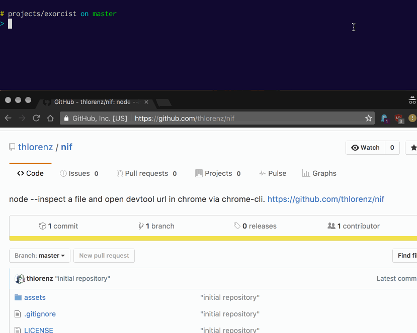

# nif

`node --inspect` a file and open devtool url in chrome via [chrome-cli](https://github.com/prasmussen/chrome-cli)

```sh
nif ./myfile
```



## Installation

### 1. Install chrome-cli

_only supports OSX ATM_

    brew install chrome-cli

### 2. Install nif

    npm install -g nif

## Requirements

Node.js v6 or higher.

## Why?

I just got tired of copy/pasting the `chrome-devtools://` url all the time.

## License

MIT
